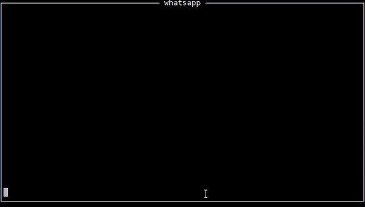

# whatsapp-cli

This CLI uses [Pushbullet APIs](https://docs.pushbullet.com/) to receive and send messages.

[Pushbullet App](https://play.google.com/store/apps/details?id=com.pushbullet.android) must be installed on your phone.

Pushbullet API token can be generated from [here](https://www.pushbullet.com/#settings/account)

Works with python2.7

Interactive(Curses) Mode - 

    Usage: __main__.py [OPTIONS]
    
    Options:
      --token TEXT  Pushbullet API token  [required]

Command Line Mode - 

	Usage: __main__.py [OPTIONS] COMMAND [ARGS]...

	Options:
	  --token TEXT  Pushbullet API token  [required]
	  --help        Show this message and exit.

	Commands:
	  add    Add a contact
	  read   Read messages from a person/group
	  send   Send message to a person/group
	  users  List all contacts

Commands Reference

	Usage: __main__.py add [OPTIONS]

	  Add a contact

	Options:
	  -u TEXT  Name of the person/group as it appears in your contacts  [required]
	  -m TEXT  12 digit mobile number  [required]
	  --help   Show this message and exit.

	Usage: __main__.py read [OPTIONS]

	  Read messages from a person/group

	Options:
	  -u TEXT  Name of the person/group. Partial names are allowed
	  --help   Show this message and exit.

	Usage: __main__.py send [OPTIONS]

	  Send message to a person/group

	Options:
	  -u TEXT  Name of the person/group or 12 digit mobile number. Partial names
			   are allowed  [required]
	  -m TEXT  Message to be sent  [required]
	  --help   Show this message and exit.

	Usage: __main__.py users [OPTIONS]

	  List all contacts

	Options:
	  --help  Show this message and exit.
